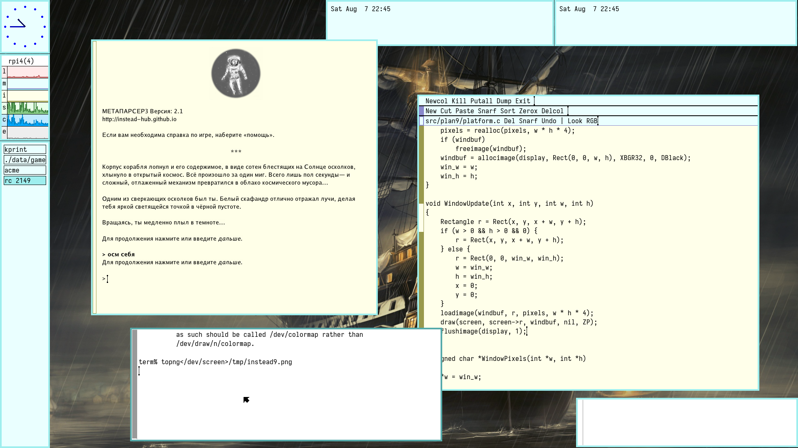

# RE:INSTEAD

Минималистичный плеер парсерных игр INSTEAD для Linux, Windows и Plan9.

- [МАНИФЕСТ](MANIFEST.md)
- [INSTEAD](https://instead.hugeping.ru)
- [МЕТАПАРСЕР](https://instead.hugeping.ru/page/metaparser/)

# Параметры

- [путь к каталогу с игрой] -- запустить игру;
- [-debug] -- запуск в режиме разработки игры (отладочная информация);
- [-scale f] -- задать масштаб.

# Конфигурация

См. файл data/core/config.lua.

------

