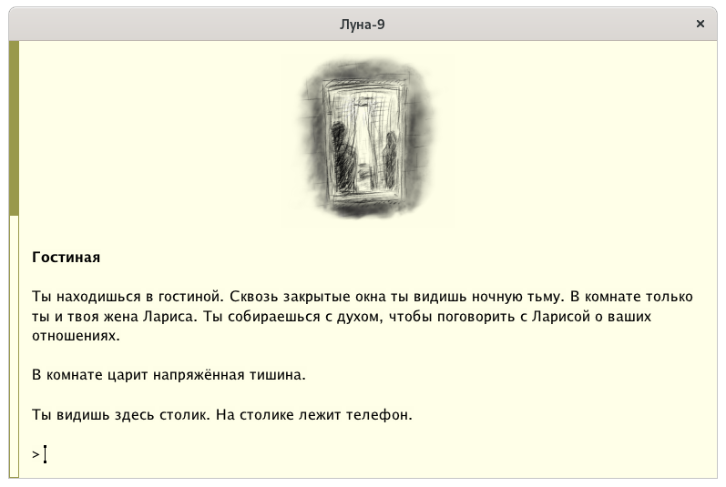
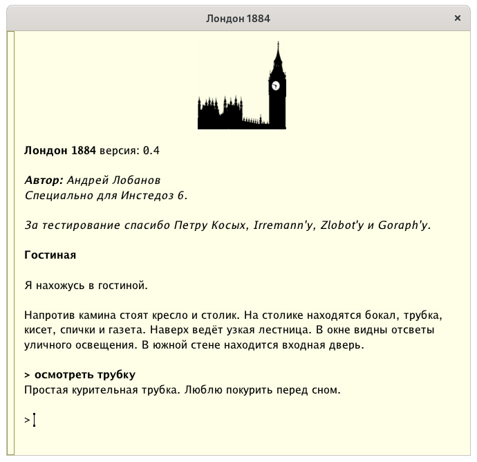
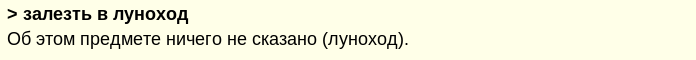
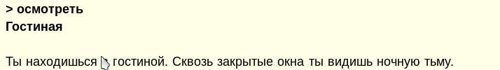
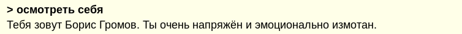
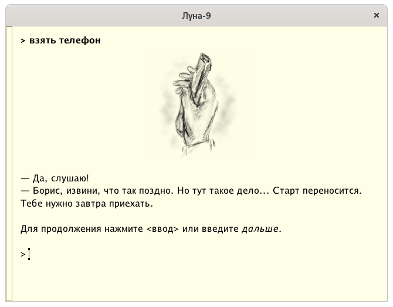
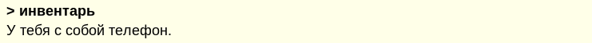
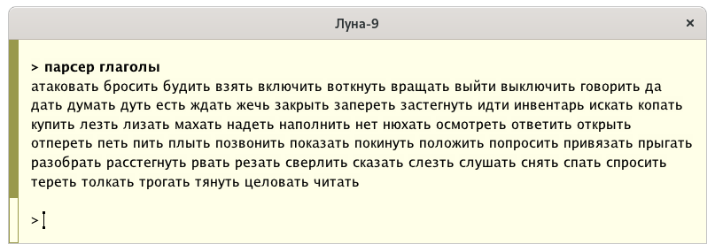
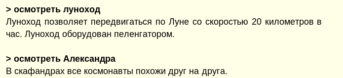
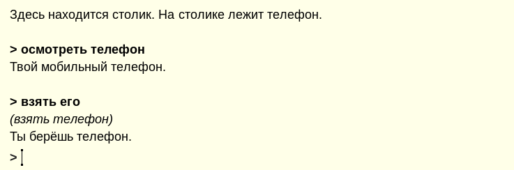

### Парсерное сопротивление

Добро пожаловать! Похоже, что вы готовы погрузиться в мир игр с
текстовым управлением? Что же, должен признаться, я очень рад это
слышать. Данное руководство содержит информацию, которая поможет вам,
если вы не были знакомы с подобными играми раньше.

### Интерактивная литература

Перед вами сборник игр с текстовым управлением. Подобные игры
появились очень давно. Вероятно, когда вас ещё не было на свете. Это
классический жанр, известный под названием _интерактивная
литература_. И это не та интерактивная литература с абзацами текста и
кнопками выбора под ними, которую можно найти в магазинах мобильных
приложений! Здесь вы получаете уникальную смесь интеллигентности
книги и театра. Когда всё, что есть перед вами -- это интерактивный
текст в ожидании _вашего_ ввода.

Подобных игр сегодня делается очень мало, особенно на русском
языке. Так что, можно сказать, вас ожидает уникальный опыт!

Не смотря на солидный возраст жанра, данные игры написаны с
использованием современного движка
[МЕТАПАРСЕР3](https://instead.hugeping.ru/page/metaparser/). Движок
учитывает особенности русского языка и содержит механизмы, которые
позволяют даже игроку без опыта не испытывать затруднений при
прохождении. Когда вы поиграете в игры этого сборника, вы сможете
играть и в другие подобные игры, которые _по-настоящему_ похожи на
интерактивные книги.

### Взаимодействие с игрой



Когда вы начинаете играть, перед вами выводится описание _сцены_ --
текущей игровой ситуацией в которой вы оказались. Внимательно
прочитайте текст сцены и подумайте, что именно вам делать?

Вы вводите команды с клавиатуры и нажимаете клавишу "ввод". Если текст
не помещается на экран, вы можете прокрутить его клавиатурой (пробел)
или мышью. Для повтора предыдущих команд вы можете воспользоваться
стрелками вверх/вниз. "Backspace" -- удаляет последний введённый
символ.

### Команды

Большинство команд задаются в форме: глагол существительное. Знаки
препинания и регистр букв не имеют значения. Например:

```
> осмотреть телефон
> взять телефон
> открыть дверь
> надеть шапку
```

Но есть команды без существительного, например:


```
> осмотреть
> ждать
> спать
> выйти
> войти
```

Или команды, которые требуют два существительных:


```
> открыть дверь ключом
> отдать ключ гоблину
> вставить кристалл в панель
```

Команды, которые требуют больше чем два существительных _не
используются_.

Игры знают множество глаголов, часть из которых являются
синонимами. Например, нет отличий между "ехать на север", "идти на
север" или даже "бежать на север". Зная это, старайтесь выбирать
привычные глаголы в неопределённой форме, такие как: "взять, бросить,
говорить, отдать, ударить, гладить, махать, крутить, дёргать, толкать
и так далее. Игре не важно, положите ли вы монету в копилку, вставите
её или засунете. Любые перечисленные команды приведут к желаемому
результату! За один "ход" игры выполняйте одно простое
действие. Формулируйте действие просто!

### Объекты

В большинстве игр с текстовым вводом принято, что взаимодействовать
можно только с теми объектами, которые упомянуты в тексте. Например,
если вы находитесь в комнате, но в описании комнаты не упомянуты: пол,
стены, люстра и многие другие объекты, то при попытке взаимодействия с
такими объектами игра сообщит вам, что они не описаны. Не удивляйтесь
этому факту! Если в комнате не упоминается люстра, значит для сюжета
истории она не важна. Работайте только с теми объектами, которые, так
или иначе, присутствуют в тексте.



Также, вы можете взаимодействовать только с теми объектами, которые
находятся в зоне досягаемости. Если вы катались на луноходе по Луне, а
потом зашли внутрь лунной базы, то при попытке выполнить команду: идти
к луноходу, вы получите сообщение о том, что луноход не описан. Просто
потому, что он не находится на данной сцене.



### Осматривание

Самая часто используемая команда (или глагол) -- осмотреть. Вы можете
осматривать сцену целиком или какие-то детали по отдельности. В любом
случае, для этого используется глагол "осмотреть".

Например:

```
> осмотреть
> осмотреть телефон
> осмотреть Ларису
```


Чтобы осмотреть всю сцену, можно набрать "осмотреть всё" или
"осмотреть". Но проще просто нажать "ввод".

Игру стоит начать с команды:

```
> осмотреть себя
```


В играх с текстовым вводом, кроме команды "осмотреть" можно также
"смотреть в" и "смотреть под".

На некоторые предметы можно садиться, ложиться, залазить в них, класть
в них (или на них) другие предметы. Например, на столик можно положить
конверт. Такие предметы стоит осматривать особенно пристально, так как
их содержимое не всегда показывается в тексте описания
сцены. Особенно, если это закрытый шкаф. Осматривая подобные предметы,
вы можете узнать о других предметах.

Иногда, вам будут встречаться сцены с текстом, для чтения которого
нужно постоянно вводить "дальше". Вы увидите это по подсказке внизу
текста. В таком случае, для продолжения чтения вы можете просто
нажимать "ввод".



### Инвентарь

Некоторые предметы вы можете брать с собой. Чтобы узнать, какие
предметы сейчас с вами, используйте команду "инвентарь".

```
> взять телефон
> инвентарь
```


### Одежда

Одежду можно надевать и снимать.

### Перемещения

Традиционно, в играх с текстовым вводом для идентификации направлений
применяется компас. Если вы видите, что в тексте сцены присутствует
сторона света, то скорее всего вы можете пойти в эту сторону. Все
перечисленные команды сработают одинаково:

```
> идти на север
> север
> с
```

Кроме направлений компаса (восток, юг, запад, восток) и промежуточных
направлений (св,юв,юз,сз), существует возможность ходить вверх (вв) и
вниз (вн). Иногда можно заходить внутрь и выходить наружу.

Кроме того, вы можете перемещаться по названию ориентира. Например:

```
идти в кабину
идти в люк
```

### Упрощённый ввод команд

Если вы хотите просто осмотреть предмет, вы можете просто написать
название предмета:

```
осмотреть телефон
телефон
```

Кроме этого, вы можете сокращать существительные.

```
осмотреть тел
```

Однако, если в сцене кроме телефона присутствует телевизор, может
возникнуть неоднозначность. Игра всегда сообщает в таких ситуациях,
что за предмет был выбран.

Некоторые глаголы тоже можно сокращать:

- о, осм - осмотреть;
- вкл - включить;
- выкл - выключить;
- ж - ждать;
- и, инв - инвентарь.

Также, доступна команда "парсер глаголы", которая выведет список
основных глаголов доступных в игре.



### Сохранение игры

Используйте команды "сохранить" и "загрузить". Вы можете именовать
сохранения, например:

```
сохранить 1
загрузить 1
```

В играх на английском языке, используются команды save/load.

### Для опытных

Вы можете выполнять последовательно несколько команд, если разделите
их точкой. Например:

```
> осмотреть луноход. осмотреть александра
```



Ещё один приём для сокращение ввода, это использование местоимений
после обращения к предмету:

```
> осмотреть телефон
> взять его
```



### Клавиатурные сокращения RE:INSTEAD

- ctrl-a -- в начало строки;
- ctrl-e -- в конец строки;
- ctrl-k или ctrl-u -- очистить строку ввода;
- ctrl-n/page down/пробел -- следующая страница;
- ctrl-p/page up -- предыдущая страница;
- ctrl-w -- удалить последнее слово;
- ctrl-+/ctrl--/ctrl-0 -- изменить размер шрифта;

### Команды RE:INSTEAD

В любой момент, кроме команд парсера действуют следующие команды:

- !info - информация об игре или Re:instead;
- !restart - начать заново;
- !load - загрузить сохранение;
- !quit - выйти;
- !save - сохранить игру;
- !saves - список сохранений;
- !rm - удалить сохранение;
- !font - показать размер шрифта;
- !font \<sz\> - задать размер шрифта;
- !tts - включить/выключить синтез речи.

### Заключение

Поздравляю, теперь вы готовы к погружению! Спасибо за чтение этого
небольшого руководства. Время не было потрачено зря, вы скоро
убедитесь в этом.

Желаю приятной игры!

_Пётр Косых, сентябрь 2021_

### Контакты

Если вам понравился сборник и вас интересуют другие похожие игры, или
вам захотелось написать отзыв:

- [Сообщество INSTEAD](https://instead-games.ru)
- [Интерпретатор INSTEAD](https://instead.hugeping.ru)
- [Станция Ping](https://club.hugeping.ru)

Если вы хотите разрабатывать игры с текстовым вводом:

- [МЕТАПАРСЕР3](https://instead.hugeping.ru/page/metaparser/)
